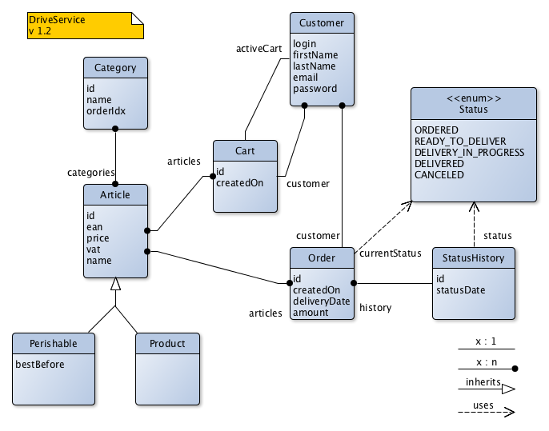

# Exercice 3/01

Consulter le modèle UML suivant :

* Créer les classes de ce modèle dans un package "fr.eservices.drive.model" en utilisant les noms exacts des attributs
* Ajouter les annotations JPA à ces classes
* Implémenter les méthodes de CatalogDao dans CatalogDaoJPAImpl
